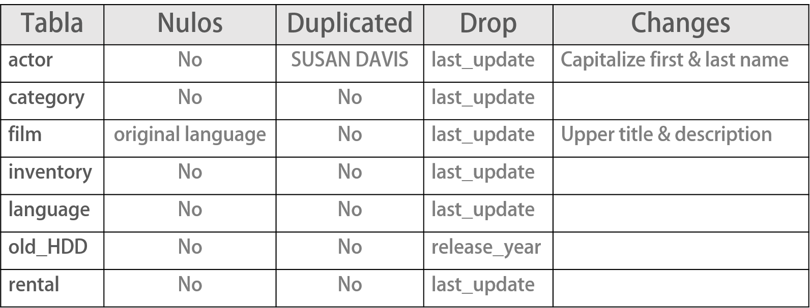
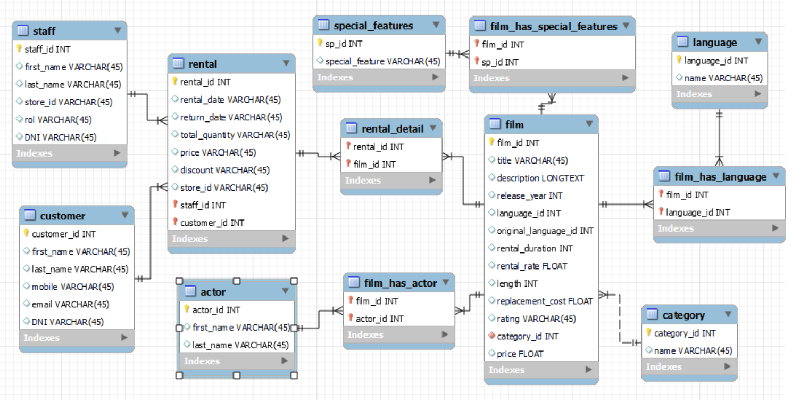
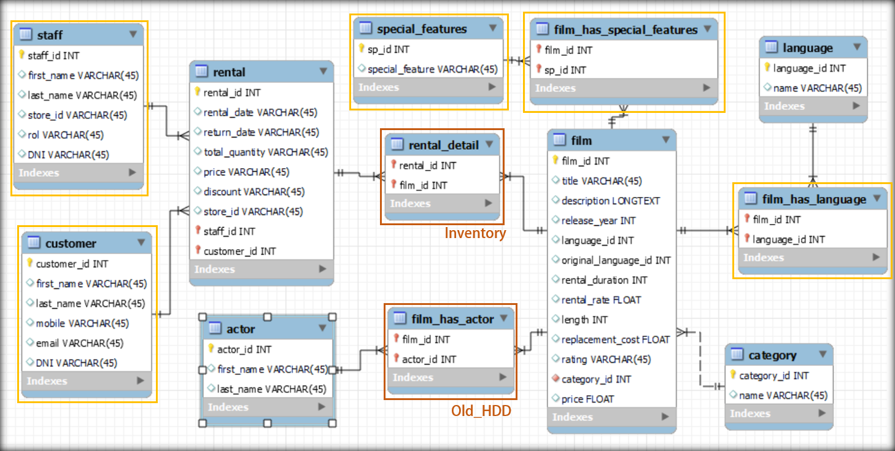
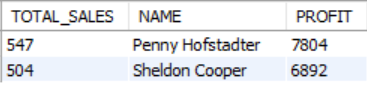
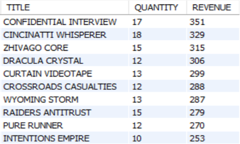
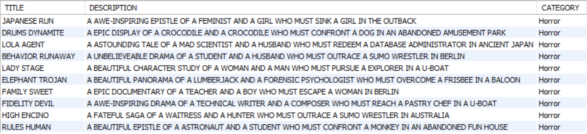
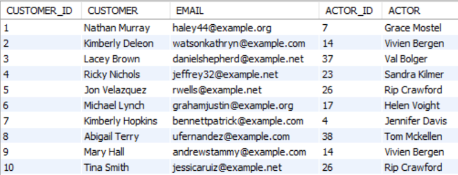

# Blockbuster Today

## I. Data Cleaning
[Notebook Link: project_db_cleaning.ipynb](src/project_db_cleaning.ipynb)
Revisión de todas las tablas para encontrar y reemplazar o eliminar valores nulos, duplicados o constantes.

1. Import libraries and scr.py file
2. Import & clean documents
   2.1. actors.csv
   2.2. category.csv
   2.3. film.csv
   2.4. inventory.csv
   2.5. language.csv
   2.6. old_HDD.csv
   2.7. rental.csv

3. Export documents

## II. Data exploration
[Notebook Link: project_data_exploration.ipynb](src/project_data_exploration.ipynb)
Una vez limpias las tablas, se pueden ver valores repetidos y asociaciones a las que hay que asignarles una tabla específica.

### 2.1. special_features:
   New table “special_features”
   Asociation with “films”: many to many
   New table “film_has_special_features”

### 2.2. category
   The only table that associates category with film is "old_HDD", so I created a new column in "films" called "category_id" and filled it according to the "film_id" contained in both tables. 
   The ones with no data were filled with the id of a new "category": "Unknown".

### 2.3. films & actor
   “actor” and “film” have a many to many relation. So, the only way to associate those two is to create the "film_has_actor" table with their corresponding id. That is only possible thanks to the charming “old_HDD” table. Ta-da!

### 2.4. Inventory & rental
   The way both tables are set up, it only allows the rental of one film at a time. So the best idea is to reconvert that table to “rental_detail” which will be the intermediate table of the many-to-many relationship between “rental” and “film” and it will only have two columns: “film_id” and “rental_id”

### 2.4 "language"
   As the last step, 'Unknown' is added to the language table and the unknown language id is added to original_language_id in film

### 3. Export documents

## III. Database filling
[Notebook Link: project_db_new_data.ipynb](src/project_db_new_data.ipynb)
Through the Fake library and the help of chatgpt, it is easy to create a fake table to update "film" with 500 more records, each with 4 actors that will go to “actors” and will be associated with “film” through the “film_has_actor” table.
I also created a fake table “customers” with 50 more records.

### 1. Import libraries and scr.py file
### 2. New records for film
### 3. New records for customer
### 4. Fill new "price" column in rental
### 5. Some extra imports and exports

## IV. ERD

### 1. New tables

[CREATE AND INSERTS.sql](src/CREATE AND INSERTS.sql)

### 2. Querys
#### Best Seller
[Best_Seller.sql](src/Best_Seller.sql)

#### Top 10 Films 
[Top_10_films.sql](src/top_10_films.sql)

#### Popular Special Features
[Popular_Special_Features.sql](src/Popular_Special_Features.sql)

#### Popular horror films
[Top_10_HORROR_Films.sql](src/Top_10_HORROR_Films.sql)

#### Favorite actor per customer
[Favorite_actor_per_customer.sql](src/Favorite_actor_per_customer.sql)

